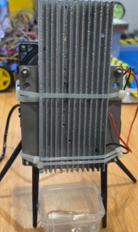
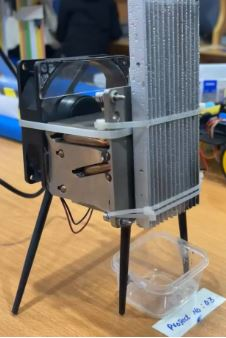

# 💧 Water Extractor from Air

> **A hardware prototype that extracts clean water from atmospheric humidity using Peltier modules.**  
> 🎓 **Course Project** &nbsp;|&nbsp; **University:** STMU — Shifa Tameer-e-Millat University  
> 🏆 **Awarded:** Sustainability Innovation Award — STMU 2024

<br>


<br>

## 🏆 Achievement

> **🌱 Sustainability Innovation Award**  
> **Shifa Tameer-e-Millat University (STMU) — 2024**  
> Recognized for innovative low-cost, eco-friendly approach to clean water generation

<br>

## 📌 About

Access to clean water is one of the most pressing global challenges — especially in arid and resource-limited regions. This project tackles that problem at a hardware level by building a **prototype device that extracts water directly from atmospheric humidity**.

The system uses **Peltier thermoelectric modules** paired with **heat sinks** and **thermal paste** to create a cold surface. When warm, humid air contacts this cold surface, the moisture in the air **condenses into water droplets**, which are then collected in a container below — producing clean water from air alone.

This solution is:
- ♻️ **Sustainable** — no external water source required
- 💰 **Low-cost** — uses affordable, widely available components
- 🌍 **Scalable** — applicable in arid zones, remote areas, and disaster relief scenarios

<br>

## ⚙️ Components & Materials

| # | Component | Role |
|---|-----------|------|
| 1 | Peltier Module (TEC1-12706) | Thermoelectric cooler — creates cold surface for condensation |
| 2 | Cold Heat Sink | Absorbs cold side of Peltier; surface where water condenses |
| 3 | Hot Heat Sink | Dissipates heat from the hot side of Peltier module |
| 4 | Thermal Paste | Ensures efficient heat transfer between Peltier and heat sinks |
| 5 | DC Power Supply | Powers the Peltier module |
| 6 | Collection Container | Catches condensed water droplets |
| 7 | Mounting Frame | Holds the assembly upright and stable |

<br>

## 🧠 How It Works

The working principle is based on the **Peltier / thermoelectric effect** — when electric current passes through a Peltier module, one side gets cold and the other gets hot.

**1️⃣ Power the Peltier Module**
- DC current is applied to the Peltier (TEC) module
- One face becomes **cold** (typically 5–15°C below ambient)
- The opposite face becomes **hot** and must be dissipated

**2️⃣ Heat Management**
- **Thermal paste** is applied between the Peltier faces and the heat sinks
- This maximises thermal conductivity and efficiency
- The **hot heat sink** radiates excess heat away from the device
- The **cold heat sink** maintains a low-temperature surface exposed to air

**3️⃣ Condensation Occurs**
- Warm, humid ambient air contacts the cold heat sink surface
- When air temperature drops below the **dew point**, moisture condensates
- Water droplets form on the cold metal fins of the heat sink

**4️⃣ Water Collection**
- Droplets accumulate and drip down by gravity
- A **collection container** placed beneath catches the extracted water
- Output volume depends on ambient humidity, temperature differential, and surface area

```
DC Power Supply
      │
      ▼
 Peltier Module
  ┌───┴───┐
  │       │
Cold     Hot
Side     Side
  │       │
Cold     Hot
Heatsink Heatsink
  │         └──→ Heat dissipated to environment
  │
Condensation forms on cold fins
      │
      ▼
  💧 Water collected in container
```

<br>

## 🌡️ Key Physics

| Concept | Description |
|---------|-------------|
| **Peltier Effect** | Electric current through two dissimilar conductors creates a temperature differential |
| **Dew Point** | Temperature at which air becomes saturated and moisture begins to condense |
| **Thermal Conductivity** | Thermal paste maximises heat transfer between Peltier and heat sinks |
| **Condensation** | Water vapour in air transitions to liquid when cooled below dew point |

<br>

## 📸 Project Gallery

### 🔩 Prototype — Front & Side View

| Front View | Side View |
|:----------:|:---------:|
|  |  |

> Cold heat sink fins visible on the front — this is where condensation forms.  
> Hot heat sink mounted on the rear for heat dissipation.  
> Collection container placed beneath to catch water droplets.

<br>

## 📁 Repository Structure

```
water-extractor-from-air/
├── README.md                        # This file
├── LICENSE                          # MIT License
└── images/
    ├── front_view.jpg               # Front view of prototype
    └── side_view.jpg                # Side view of prototype
```

<br>

## 🌍 Real-World Applications

- **Arid & desert regions** — where groundwater is scarce or contaminated
- **Disaster relief** — rapid deployment for clean water in crisis zones
- **Remote communities** — off-grid water generation without infrastructure
- **Climate adaptation** — sustainable alternative to traditional water sourcing

<br>

## 🔬 Future Improvements

- Add a fan to actively circulate air over the cold heat sink for higher output
- Use solar panels to make the system fully off-grid and sustainable
- Implement a temperature/humidity sensor (DHT22) to monitor efficiency in real time
- Scale up surface area with multiple Peltier modules for higher water yield
- Add a water quality sensor to verify purity of collected water
- Insulate the hot side more effectively to improve cold side temperature drop

<br>

## 🧩 Concepts Demonstrated

- **Thermoelectric Effect (Peltier)** — converting electrical energy into a temperature gradient
- **Heat Transfer** — conduction via thermal paste, convection via heat sink fins
- **Phase Change (Condensation)** — gas-to-liquid transition at the dew point
- **Sustainability Engineering** — designing low-cost solutions for real-world resource problems

<br>

## 👩‍💻 Author

**Khansa Bint-e-Zia**

[](https://github.com/Khansa972)
[](https://www.linkedin.com/in/khansa-bint-e-zia-791766361)

<br>

## 📄 License

This project is open-source under the [MIT License](LICENSE).

---

<div align="center">
  Made with 💧 by <a href="https://github.com/Khansa972">Khansa Bint-e-Zia</a> &nbsp;|&nbsp; STMU &nbsp;|&nbsp; 🌱 Sustainability Innovation Award 2024
</div>
